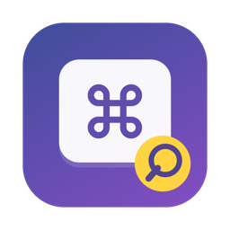
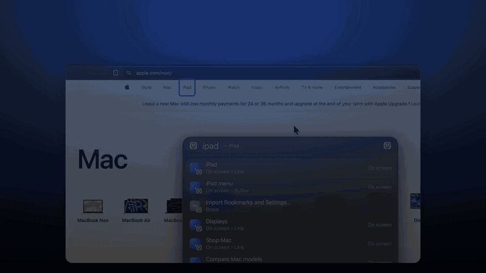
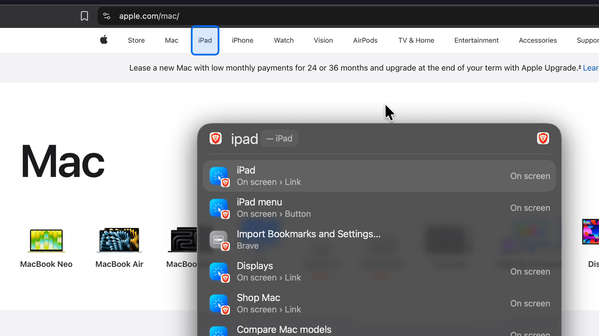
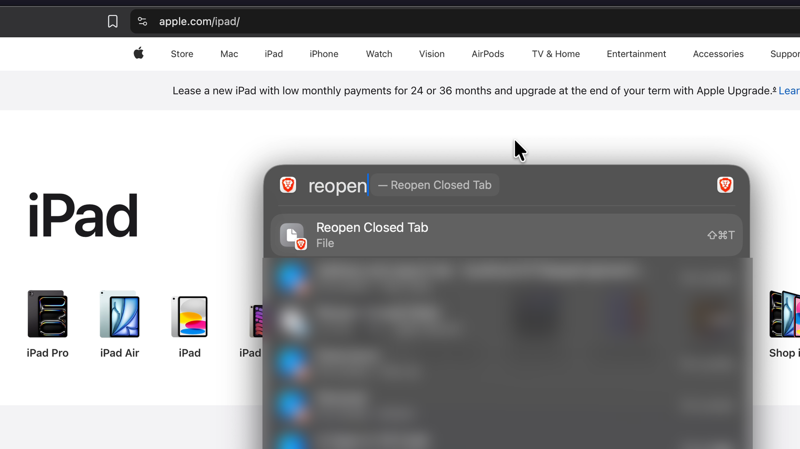
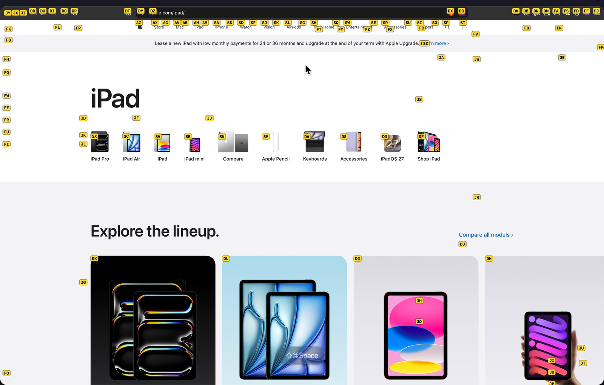
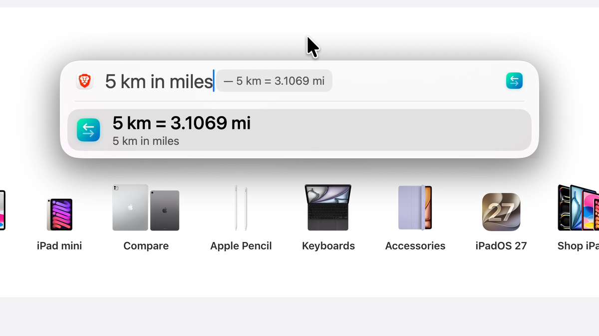
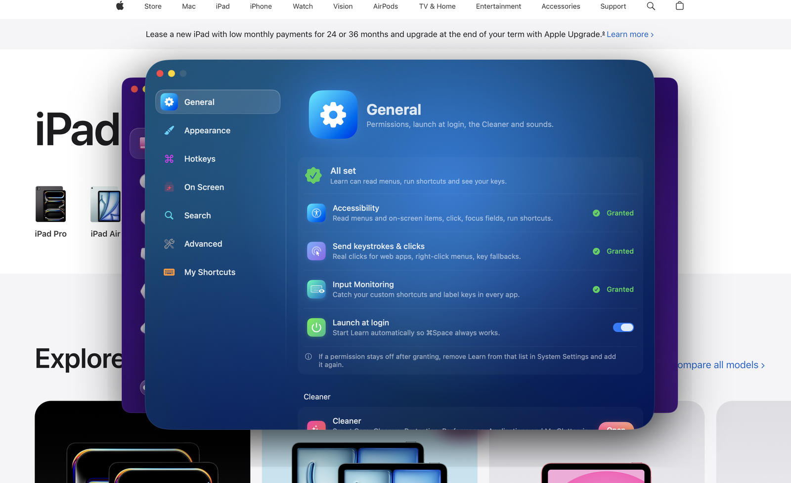
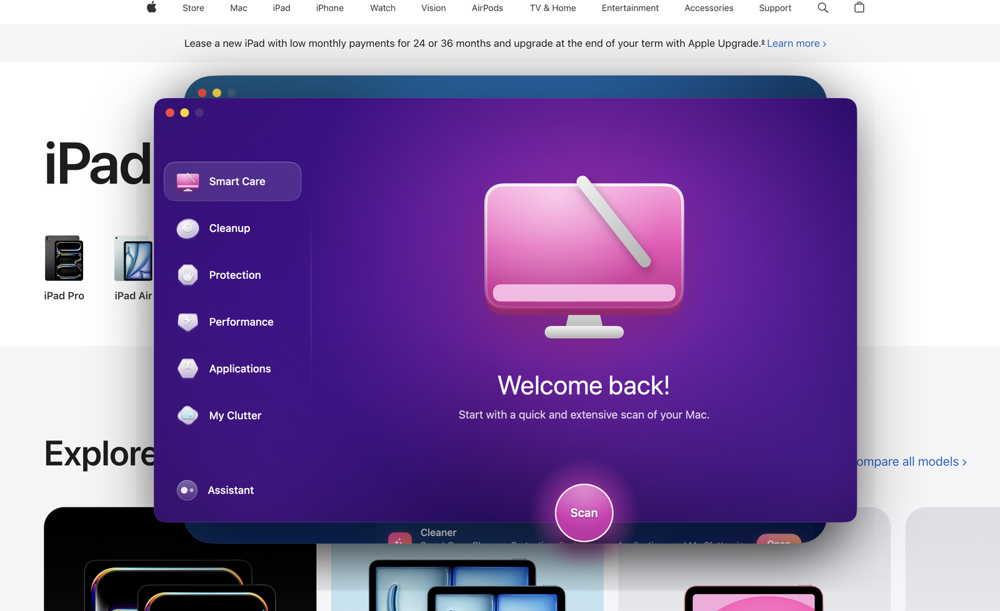

<div align="center">



# Learn

### Spotlight, overpowered.

One search for every app's menu shortcuts, the buttons and links on your screen, your apps, files and quick answers.<br>
Type what you see, and Learn clicks it.

[**⬇ Download for macOS**](https://github.com/erluxman/learn/releases/latest/download/Learn.dmg) &nbsp;·&nbsp;
[Watch the 20-second demo](docs/learn-demo.mp4) &nbsp;·&nbsp;
[Build from source](#build-from-source)

<sub>Free · macOS 14 Sonoma or later · Apple Silicon & Intel · no account, no network, no tracking</sub>

<br>

<a href="docs/learn-demo.mp4"></a>

</div>

---

## What it does

Press **⌥Space** (or take over **⌘Space**) in any app and start typing.

| | |
|---|---|
| **Click what you see** <br><br> Buttons, links, tabs, rows and fields on screen are all searchable. Type `ipad` on apple.com and the iPad link comes first, outlined on the page. Press ↩ and Learn clicks it. Works in native apps, browsers (Brave, Chrome, Arc, Edge…) and Electron apps. |  |
| **Every menu shortcut, in every app** <br><br> Learn reads each app's menu bar, so every command and its key is one search away. Type `reopen` in a browser: *Reopen Closed Tab ⇧⌘T*. ↩ runs it, even if you never learn the keys. |  |
| **Labels on everything** <br><br> **⌘⇧Space** puts a short label on every clickable thing on screen. Type the letters and it's clicked. No mouse needed. |  |
| **Even inside terminal apps** <br><br> Terminal UIs like herdr draw their buttons as plain text. Learn reads the terminal's character grid and clicks the exact cell. It works over Ghostty's drop-down quick terminal too, without hiding it. | |
| **Apps and quick answers** <br><br> Launch apps, do math (`18% of 2450`), convert units (`5 km in miles`) and look up definitions. ↩ copies the answer. |  |

### And more

- **Your own shortcuts for any menu item.** Select a result, press ⌘↩ and record a combo. It works right away, in any app, without touching the app's own settings.
- **Shortcut bubble.** Shows the keys you press and their command names on screen, which is handy for learning shortcuts, screencasts and demos.
- **Keyboard pointer.** ⌥⇧Space moves the mouse with the keys: click, right-click, drag and scroll.
- **Frequently used and suggested.** Learn remembers what you run and ranks the useful commands of each app first.
- **Liquid Glass look.** It looks like Spotlight by default. Glass, color, grain, fonts and sounds are all customizable.
- **Cleaner.** A built-in Smart Care, Cleanup, Protection and Performance overview of your Mac. It scans only and never deletes anything on its own.

<p align="center">
  
  
</p>

## Install

1. Download **[Learn.dmg](https://github.com/erluxman/learn/releases/latest/download/Learn.dmg)** (or [Learn.zip](https://github.com/erluxman/learn/releases/latest/download/Learn.zip)).
2. Open it and drag **Learn** to **Applications**.
3. Open Learn. Its Settings window lists the permissions it needs, with a **Grant** button for each:
   - **Accessibility**: reads menus and on-screen items, and runs shortcuts.
   - **Input Monitoring**: catches your custom shortcuts and label keys.
4. Press **⌥Space**. To use **⌘Space** instead, go to Settings ▸ Hotkeys.

> [!NOTE]
> Learn isn't notarized by Apple yet. If macOS says it "can't be opened", right-click Learn in Applications and choose **Open**. Or go to **System Settings ▸ Privacy & Security** and click **Open Anyway**. You only need to do this once.

## Keys

| Key | In the Learn panel |
|---|---|
| ⌥Space / ⌘Space | Open or close Learn |
| ↩ | Run the shortcut, click the item, or open the app |
| ⇥ / ⇧⇥ | Next / previous result (⇥ on an app shows its shortcuts) |
| ⇥ on an empty search | Search only what's on screen |
| ⇥ + Space | Right-click the highlighted on-screen item |
| ⌘↩ | Record your own shortcut for the selected item |
| ⌘R | Rescan the current app |
| ⎋ | Close |

| Anywhere | |
|---|---|
| ⌘⇧Space | Label every clickable item on screen |
| ⌥⇧Space | Control the pointer with the keyboard |
| Left ⌃ + right ⌃ | Right-click at the pointer |

All of these can be changed in Settings ▸ Hotkeys.

## Privacy

Learn runs entirely on your Mac. It makes no network requests and has no analytics. Its shortcut database, usage counts and settings stay in `~/Library/Application Support/Learn/`. Permissions are used only to read menus and on-screen items and to press them when you ask.

## Build from source

Requires Xcode 15.3+ (Swift 5.10) on macOS 14+. There are no dependencies.

```bash
git clone https://github.com/erluxman/learn.git
cd learn
./build.sh      # release build → signs → installs to /Applications → launches
./package.sh    # universal (arm64 + x86_64) dist/Learn.dmg and dist/Learn.zip
```

`build.sh` signs with your first Apple Development certificate, so the permissions you grant survive rebuilds. Without one it falls back to ad-hoc signing.

## Uninstall

```bash
./uninstall.sh          # removes the app, resets its permissions, gives ⌘Space back to Spotlight
./uninstall.sh --purge  # also deletes its database and settings
```

Or drag Learn from Applications to the Trash.
